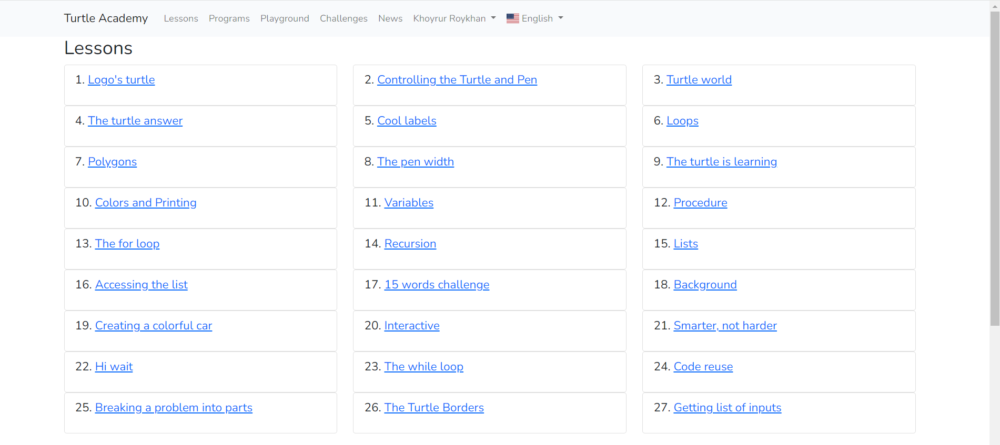
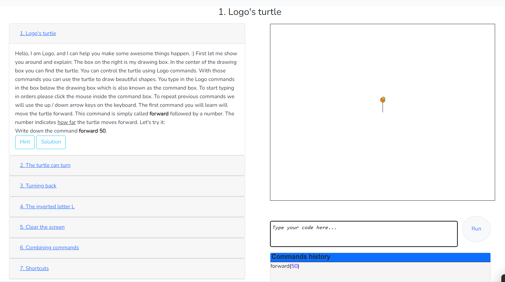

# Turtle Academy as : Tutor, Tool, Tutee
[Website Turtle Academy](https://turtleacademy.com/)

### Turtle Academy Description
Turtle Academy adalah platform edukasi yang dirancang untuk mengajarkan prinsip-prinsip pemrograman menggunakan bahasa Python (Library Turtle). Platform ini menawarkan pelajaran interaktif yang cocok untuk anak-anak, memungkinkan mereka belajar coding dengan cara yang menyenangkan dan mudah dipahami. Melalui pendekatan pemrograman visual, Turtle Academy membuat proses pembelajaran menjadi lebih menarik dengan memberikan hasil yang cepat. Selain itu, platform ini juga terbuka untuk kolaborasi dari sukarelawan yang ingin membantu menerjemahkan situs ini ke berbagai bahasa, sehingga dapat diakses oleh lebih banyak orang di seluruh dunia.

#### Turtle Academy as Tutor :
Turtle Academy dapat berfungsi sebagai **tutor/pengajar** dalam memahami dasar-dasar pemrograman Python (Library Turtle). Turtle Academy menyajikan beberapa materi seperti dibawah ini :

disetiap tutorial pengguna dapat langsung **menanggapi** dengan mencoba kodenya langsung pada website dan Turtle Academy juga memberikan **feedback** berupa solusi ataupun hasil dari evaluasi.

#### Turtle Academy as Tool
Turtle Academy dapat berfungsi sebagai **alat** kode editor Python(Library Turtle). jadi selama pengguna mempelajari bahasa pemrograman tersebut pengguna tidak perlu membuka kode editor lagi untuk mencoba menjalankan programnya, program bisa langsung dijalankan di website tersebut.

#### Turtle Academy as Tutee
Menggunakan komputer sebagai murid berarti menjadi tutor bagi komputer; untuk itu, siswa atau guru yang menjadi tutor harus belajar membuat program. didalam Turtle Academy pengguna bisa membuat program yang dibaca langsung oleh komputer dan menampilkan hasilnya.